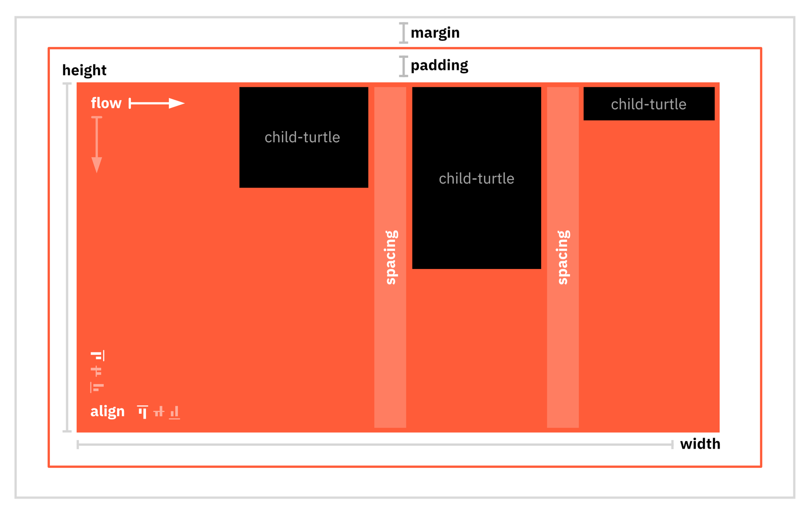

# Makepad Draw

Makepad’s 2D and (soon) 3D drawing layer that sits on top of Makepad Platform.

It contains:

- the immediate mode 2D context
- the turtle layout system
- the font engine
- the vector engine
- image decoding
- base shaders
- the shader standard library

## Walk-through of a basic application

The essential parts of Makepad applications are defined by

- a DSL definition
- an app struct

The following code draws a red 100 x 100 px rectangle.

```rust
use makepad_widgets::*;

live_design!{
    import makepad_widgets::desktop_window::DesktopWindow;
    import makepad_widgets::hook_widget::HookWidget;
    App = {{App}} {
        ui:<DesktopWindow>{
            <HookWidget>{}
        }
        draw_bg: {
            fn pixel(self)->vec4{
                return #f00
            }
        }
    }
}

app_main!(App);

#[derive(Live)]
pub struct App {
    #[live] ui: WidgetRef,
    #[live] draw_bg: DrawQuad
}

impl LiveHook for App {
    fn before_live_design(cx: &mut Cx) {
        crate::makepad_widgets::live_design(cx);
    }
}

impl AppMain for App{
    fn handle_event(&mut self, cx: &mut Cx, event: &Event) {
        if let Event::Draw(event) = event {
            let cx = &mut Cx2d::new(cx, event);
            while let Some(_) = self.ui.draw_widget(cx).hook_widget() {
                self.draw_bg.draw_walk(cx, Walk::fixed(100.,100.));
            }
        }
    }
}
```

**Step by Step:**

```rust
live_design!{
    import makepad_widgets::desktop_window::DesktopWindow;
    import makepad_widgets::hook_widget::HookWidget;
    App = {{App}} {
        ui:<DesktopWindow>{
            <HookWidget>{}
        }
        draw_bg: {
            fn pixel(self)->vec4{
                return #f00
            }
        }
    }
}
```

`live_design` contains the live-DSL part of the application which defines layout and styling.

```rust
app_main!(App);
```

The `app_main` macro defines the application’s entry points for all supported platforms (web, iOS, Android, MacOS, Windows and Linux). To achieve cross-platform support, the code must be macro-generated and cannot be a simple `fn main()` function.

```rust
#[derive(Live)]
pub struct App {
    #[live] ui: WidgetRef,
    #[live] draw_bg: DrawQuad
}
```

The main app struct `App` uses the `derive(Live)` proc macro to generate the glue that deserializes the live_design DSL into the App struct. In Makepad’s terminology this is called *applying* the live DSL to a Rust struct.

```rust
impl LiveHook for App {
    fn before_live_design(cx: &mut Cx) {
        crate::makepad_widgets::live_design(cx);
    }
}
```

The `LiveHook` implementation for App allows hooking of various object lifecycle stages as they are connected to the Live DSL.

**Examples**

- `before_live_design`: This phase is where `live_design` is registered. During this phase, live design dependencies such as widget libraries can be specified and components can be registered
- `after_new_from_doc` This is similar to a traditional constructor-moment

```rust
impl AppMain for App{
    fn handle_event(&mut self, cx: &mut Cx, event: &Event) {
        if let Event::Draw(event) = event {
            let cx = &mut Cx2d::new(cx, event);
            while let Some(_) = self.ui.draw_widget(cx).hook_widget() {
                self.draw_bg.draw_walk(cx, Walk::fixed(100.,100.));
            }
        }
    }
}
```

`AppMain` is the trait implemented for `App`. It provides the only entry point into the application from the system: `fn handle_event`. The trait provides mouse, timer, and swipe events, which are passed down into the UI-tree to be handled. However in this example, only the `Draw` event is significant. This is where the system requests the application to generate the necessary rendering structures.
In this case, `Cx2d` is created, which is the immediate mode draw context defined in `makepad-draw`. It layers an immediate mode drawing onto the render-tree provided by `makepad-platform`. All UI drawing in Makepad is done using immediate mode. Anything that's not drawn during the draw event flow won't exist in the render tree and therefore won't be visible.

## Drawing with Cx2d

In this example, the `DesktopWindow` widget serves as the main retained mode draw flow control. However, the `<HookWidget>` inside it allows for an immediate mode hook point.

Immediate mode shaders like the `DrawQuad` shader can be used to draw within the `while()` loop. This conceptually works in a similar way to a *canvas API*, where drawing shapes are directly added to the render-tree.

This example draws a quad (a rectangle) with a simple red color shader. The `Walk::fixed()` constructor specifies that it should be drawn with a width and height of 100 pixels.

> 💡 Even in retained mode structure, all drawing is done in immediate mode [(more infos)](https://www.notion.so/Makepad-Architecture-v1-2-c8089aa477c14c349a57e0e633c556ba?pvs=21). For now, assume that the `while()` only loops once when the UI needs to be redrawn.

### The turtle

`Cx2d` supports immediate mode *auto layout*, a unique feature that is not present in canvas APIs. This allows the context to perform simple rectangle computations for layout purposes.

The foundation for this layout system is the *turtle stack*. Every time a parent (i.e. a container box) or a child is created, a new turtle is initiated for this element. Calling `begin` and `end` on elements allows for nesting of turtles.

*Outside* properties of turtles:

- `width`
- `height`
- `margin`

*Inside* properties of turtles that control what child-turtles do

- `flow` (-direction)
- `spacing`
- `align`
- `padding`



The turtle stack is not a separate pass, but rather runs the layout *inline* with the drawflow. This approach works well and is very fast for drawing a lot of UI. Additionally, this layout model supports aligning elements to the center, right, and bottom by moving elements within the draw-tree at the tail end of the drawflow.

However, there are cases that cannot be easily implemented this way. For example, scaling a rectangle to the largest of all siblings requires a two-pass mode that has not been built, yet.

### Shader standard library

A common approach to drawing in Makepad is to use shaders that derive from `DrawQuad`, which is a bounding-box aligned rectangle. To draw on this rectangle, a pixel-shader is used that defines a signed distance field (SDF) shape.

**Example** A red rounded-corner box instead of the red rectangle

```rust
import makepad_draw::shader::std::*;
…<snip>..draw_bg: {
   instance hover: 1.0
   fn pixel(self)->vec4{
      let sdf = Sdf2d::viewport(self.pos * self.rect_size);
      let radius = 10.0;
      sdf.box(1.,1.,self.rect_size.x-2,self.rect_size.y-2, radius);
      sdf.fill(mix(#f00,#0f0, self.hover)));
      return sdf.result 
   }
}
```

The `Sdf2d` struct serves as the drawing API in the pixel shader. The box blends between red and green using an additional hover variable that can be set from the CPU side.
