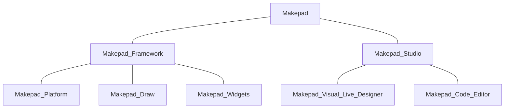

# What is Makepad?

Makepad is used to mean many different things. In this document, we want to clarify what we mean by *Makepad* and the various things related to the project.

At the highest level, Makepad refers to the Makepad Project that is located on github: [Makepad](https://github.com/makepad/makepad)

Makepad is an unique and innovative application development framework that is built using the Rust programming language. It aims to provide developers with a fast and efficient way to create interactive applications and UI that can run on a variety of platforms including desktop, web, and mobile platforms.

### Why Rust

Makepad uses Rust's high-level abstractions and modern language features to make it easier to write complex UI code while ensuring memory safety, speed, and reliability. It has a flexible and modular architecture, which allows developers to build customized UI components and easily integrate them into their applications.

One of the key strengths of Makepad is its performance. By using Rust, which is a highly performant language that provides low-level control over system resources, applications built with Makepad can be highly optimized and run smoothly even on resource-constrained devices such as the Raspberry Pi.

## Makepad Project

The Makepad project is open-source and consists of two major components: the Makepad Framework and the Makepad Studio.

The Makepad Framework provides the platform and UI toolkits for building applications, while the Makepad Visual Live Designer utilizes and is built atop of the Makepad Framework.

The combination provides both a cross-platform UI toolkit and an interactive IDE for building high-performance and visually appealing applications. It is designed to provide a complete solution for creating complex, interactive interfaces for desktop and web applications using the Rust programming language.

* **Makepad Framework** is cross-platform, meaning that it can be used to build applications for Windows, MacOS, Linux desktop, mobile (Android and iOS), tvOS, as well as for the web environments. Using the sinlge codebase, Makepad compiles directly to each of the various hardware platforms. It uses WebAssembly (WASM) to compile Rust code to run in web browsers, enabling developers to create web applications with the same performance and features as native desktop applications.

* **Makepad Studio**, which is an application developed using the Makepad Frameowrk, is a rich, graphical IDE that provides a powerful code editor with syntax highlighting, auto-completion, and live code reloading. It also includes a visual interface editor that allows developers to create and edit UI elements visually, without writing manual code.

## Summary

Overall, Makepad is a powerful and flexible framework that offers a modern approach to building high-performance applications and the built-in IDE makes it easy to create visually appealing cross-platform applications.

Its use of Rust and focus on performance make it an attractive option for developers looking to build high-performance applications, while its modular design and live coding support make it a productive tool for creating interactive user interfaces.

The cross-platform capabilities make it an excellent choice for developers looking to create complex and interactive UIs for desktops, mobile, and web applications while maximizing code-reuse and minimizing code development time.

