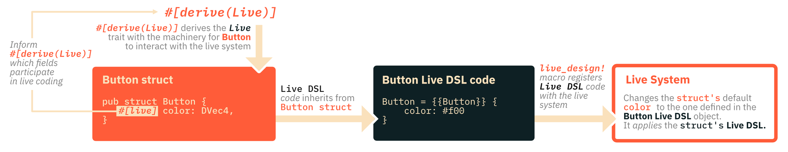
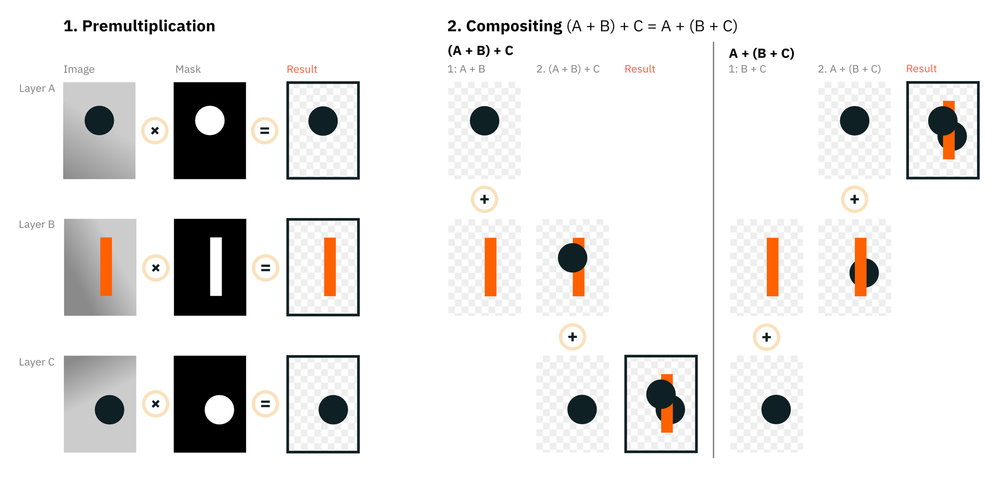

# Makepad Platform

Makepad’s main platform abstraction layer.

It contains:

- the windowing system with keyboard, mouse and touch input
- the live system
- the shader compiler / graphics APIs
- networking
- the video capture APIs
- the audio APIs

## Live System

The *Live System* enables updates of Makepad applications during runtime. Full live coding can’t be achieved since Rust is a statically compiled language. Therefore Makepad follows a hybrid approach:

| Layout and style | Application logic |
| --- | --- |
| LIVE DSL (Makepad’s Domain-specific-language for layout and style) | Rust code |
| Live updatable / live coding | Not live updatable / no live coding |
| Interpreted at runtime | Not interpreted at runtime |

*Live DSL* code blocks are embedded in Rust source files via procedural macros.

Example: Button widget with a live codeable color
```rust
live_design! {
    Button = {{Button}} {
        color: #f00
    }
}

#[derive(Live)]
pub struct Button {
   #[live] color: DVec4,
}
```

This `Button` struct defines a button widget with a single field, `color`, which specifies its color. (Additional fields and methods that a real button would require were omitted for the sake of exposition.)

The `#[derive(Live)]` attribute automatically derives the `Live` trait for `Button`, providing all the necessary machinery for `Button` to interact with the live system. In particular, it provides a method that returns type information about `Button`, such as its names and field types.

The `#[live]` attribute informs the `#[derive(Live)]` attribute which fields of `Button` participate in live coding. Conversely, the `#[rust]` attribute would mark fields that should not participate.

The `live_design` macro defines a `live_design` function that registers a block of Live DSL code with the live system. The code within the macro is serialized to a string, which is later parsed by the live system.

Fields of newly created Rust structs are initialized to their default values. Makepad's live system then *applies* the Live DSL definition of the struct, overwriting all fields for which the Live DSL has definitions.



> 💡 No other object can inherit from the same struct, as there can only be one definition of it.

In this case, `Button: {{Button}}` defines a Live DSL object called `Button`. This object "inherits" from a Rust struct also called `Button`. The Live system then applies the struct's Live DSL definition and updates the default `color` value to the one specified in the `Button` Live DSL object.

The Live system enables live coding by providing the machinery for an IDE to:

- connect to a running application
- detect whether the code being edited is part of a Live DSL block
- send the new Live DSL code to the running application as a string
- reapply the definitions in the new Live DSL code to their corresponding structs

The Live DSL resembles serialization formats like JSON. It can be used to initialize and update existing objects, as well as to create new ones. Additionally, it has several features that JSON lacks, making it more suitable for things like overridable styling. One of these features is inheritance, which will be discussed next.

### Inheritance

**Example: Widget with two buttons**

```rust
live_design! {
    TwoButtons = {{TwoButtons}} {
        button_0: {},
        button_1: {
            color: #0f0,
        }
    }
}

#[derive(Live)]
pub struct TwoButtons {
   #[live] button_0: Button,
   #[live] button_1: Button,
}
```

The Live DSL object `TwoButtons`  provides the Live DSL definition for the Rust struct `TwoButtons`.

The previous example ignored that the Live system *expands* the Live DSL definition to its corresponding struct before applying it. Expansion is a form of prototypical inheritance that works as follows:

1. The Live system encounters a Live DSL object that inherits from a Rust struct.
2. It iterates over all of the struct’s fields that are marked with `#[live]`, using the type information provided by the `Live` trait.
3. The system sets all types that have a registered Live DSL definition to their respective Live DSL value.

The recursive overwriting rules are best illustrated by an example:

Object `A`

```rust
A = {{A}}{
    a0: { b0: 1.0, b1: 2.0 },
    a1: { b0: 3.0 },
}
```

Object `B`

```rust
B = <A>{
    a0: { b0: 5.0 },
    a1: { b1: 6.0 },
}
```

Object resulting from overwriting `A` with `B`

```rust
{
    a0: { b0: 5.0, b1: 2.0 },
    a1: { b0: 3.0, b1: 6.0 },
}
```

Object resulting from overwriting `A` with `B`

**Overwriting rules**

- When a field appears in `A`, but not in `B`,
it also appears in the result. (Diagram **Field 1**)
- When a field appears in `B`, but not in `A`,
it also appears in the result. (Diagram **Field 2**)
- When a field appears in both `A` and both `B`,
the version in `B` wins. (Diagram **Field 3B**)


> 💡 Expansion is a recursive process. Thus, when the Live system copies a Live DSL definition to set as the value of a field, the Live DSL definition will have already been recursively expanded.

Simplified before / after comparison of the `TwoButtons` Live DSL definition:

Before expansion

```rust
TwoButtons = {{TwoButtons}} {
    button_0: {},
    button_1: {
        color: #0f0,
    }
}

```

After expansion

```rust
TwoButtons = {{TwoButtons}} {
    button_0: {{Button}} {
        color: #f00,
    },
    button_1: {{Button}} {
        color: #0f0,
    }
}
```

- `button_0`
Only the Live DSL definition for `Button` was copied over, so that `button_0` has the same color as the original `Button`.
- `button_1` 
The value of `color` was overridden by copying over `#0f0` from the DSL object.
If the Live DSL definition of `Button` would have had any other fields, they would have appeared unchanged.

### Hooks

Widget lifecycles consist of several discrete events, during which specific actions can be executed with the help of hooks. To define a hook for each event, implement the `LiveHook` trait.

Every Live struct should implement this, which was omitted in prior examples for the sake of exposition.`#[derive(LiveHook)]` provides a default implementation of `LiveHook` for cases when no hooks are needed.
Most components will have to implement the `before_live_design` hook at a minimum. This hook is used to register the component as a widget or to load up dependent crates:

```rust
impl LiveHook {
    fn before_live_design(cx: &mut Cx) {
        register_widget!(cx, Button)
    }
}
```

Another purpose of `LiveHook` is to allow widgets to override how they update themselves from their Live DSL definition. This enables custom Live DSL behavior, which can be useful in certain situations.

The Live DSL provides two different property-types to facilitate customizing its behavior.

| Field properties | Instance properties |
| --- | --- |
| Defined with a : | Defined with a = |
| Set or update corresponding Rust struct fields | Allow widget dependent behavior |
| Ordinary properties | Special properties with no Rust counterpart |

> 💡 *Instance properties* show up during deserialization just like *field properties.* See [below](https://www.notion.so/Makepad-Architecture-v1-2-c8089aa477c14c349a57e0e633c556ba?pvs=21) for how the `<View>` widget implements child nodes with it.

## Shaders

*MPSL* is Makepad’s custom shader language. It’s a unified language that transpiles to the shader languages of the supported graphics APIs (OpenGL, DirectX, Metal).

**Example**

```rust
live_design! {
    DrawColor = {{DrawColor}} {
        fn pixel(self) -> vec4 {
            return vec4(self.color.rgb * self.color.a, self.color.a);
        }
    }
}

#[derive(Live)]
#[repr(C)]
pub struct DrawColor {
    #[deref] pub draw_super: DrawQuad,
    #[live] pub color: Vec4
}
```

MSPL code is a sub-DSL of the Live DSL, and thus can be embedded in Live DSL code. This example shows a Live DSL definition for the `DrawColor` struct, which represents the shader on the Rust side.

`DrawColor` inherits most of its behavior from the `DrawQuad` struct which is provided by the Makepad Draw crate, and which represents the base shader for drawing arbitrary quads.

The `#[derive(Live)]` attribute automatically derives the `Deref` trait if exactly one field has the `#[deref]` attribute.

`DrawColor` extends `DrawQuad` by adding a color with which to draw. This is accomplished by adding a `color` field to `DrawColor`.

> 💡 Shaders in Makepad use Deref inheritance. Deref inheritance is usually considered an anti-pattern in Rust, but for this particular use-case, it works well.

Rust structs that represent shaders have certain requirements:

- They need to be `repr(C)`
- Their fields are expected to have a specific order
    1. Arbitrary fields
    2. Base
    3. Per-instance attributes

This ensures that

- each nested field has a well defined offset in the struct
- each attribute appears at the end of the struct

**Example**

- Shader `A` inherits from shader `B`.
- Both `A` and `B` have
  - one or more arbitrary fields
  - one or more attributes

The overall structure would look something like this:

```rust
A {
    arbitrary_field_0,
    arbitrary_field_1,
    ...,
    #[deref] draw_super: B {
        arbitrary_field_0,
        arbitrary_field_1,
        ...
        instance_attr_0,
        instance_attr_1,
        ...
    },
    instance_attr_0,
    instance_attr_1,
    ...
}
```

Instance attributes appear at the end. When `DrawColor` instantiates its base class, `DrawQuad`, it passes its type information to `DrawQuad`’s constructor. This tells `DrawQuad` which attributes exist and their positions in the derived struct.

Drawing with `DrawColor` typically uses either `draw_abs` (for absolute drawing), or `draw_walk` (for drawing with the [turtle](https://www.notion.so/Makepad-Architecture-v1-2-c8089aa477c14c349a57e0e633c556ba?pvs=21)). These functions are defined on `DrawQuad`, but because of Deref inheritance, they are available on `DrawColor` as well.

When using this shader, calling `draw_abs`/`draw_walk` does not issue a draw call because Makepad uses instanced rendering. Instead, it appends the data for other instances to the instance buffer of the shader.

Instance data is obtained by doing a byte copy of the struct-section containing the instance attributes. Hence the need for them to be contiguous in memory and for `repr(C)`.

## Rendering

Makepad uses instanced rendering. This enhances performance by enabling the GPU to efficiently draw multiple instances of the same object in a single draw call. Each instance can still have different attributes, such as position, size, and color.

**Example**

To draw multiple quads:

- a single quad is used with normalized 0,0..1,1 vertex attributes as the base geometry
- position and size attributes of each quad are defined per instance
- the GPU positions and scales instances according to their per-instance attributes

Makepad uses [premultiplied alpha blending](https://en.wikipedia.org/wiki/Alpha_compositing?useskin=vector#Straight_versus_premultiplied). Premultiplied alpha blending is associative. This means that when compositing multiple layers, the order in which layers are grouped together does not matter. For example, if we have three layers `A`, `B`, and `C`, we would composite them as either `(A + B) + C` or `A + (B + C)`.
This is important, because it allows us to group static layers together and pre-render them to a texture, instead of re-rendering them each frame. We can then composite this pre-rendered texture with any dynamic layers and obtain the same result, while greatly reducing the amount of work required to render each frame.
By default, Makepad renders with the z-buffer on. This allows Makepad applications to be embedded seamlessly in 3D scenes such as in VR/AR.

Makepad uses [premultiplied alpha blending](https://en.wikipedia.org/wiki/Alpha_compositing?useskin=vector#Straight_versus_premultiplied) [fig 1], which is associative. As a result, the grouping order of layers does not matter during compositing. For example, compositing the layers `A`, `B`, and `C` as `(A + B) + C` or as `A + (B + C)` leads to the same result [fig 2].



Static layers, which are grouped and pre-rendered to a texture, provide better performance than layers that are re-rendered every frame. Combining this texture with dynamic layers requires much less rendering work for each frame.
Makepad renders with the z-buffer enabled by default. This allows Makepad applications to be seamlessly embedded in 3D scenes, such as VR or AR environments.

> 💡 Note that rendering with the z-buffer on requires drawing the UI from back to front. Fortunately, Makepad's draw APIs already handle this automatically.
