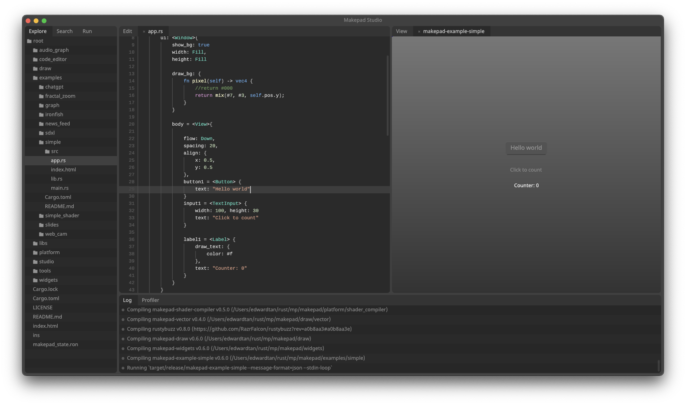

# Makepad Studio

The Makepad Live Designer provides live editing capability and real-time collaborative editing system enables multiple developers to work on the same project simultaneously.

This support for live coding allows developers to see changes to their code in real-time as they make them, without the need to compile and run the entire application each time. This can greatly speed up the development process and enable developers to quickly iterate on their ideas.

There’s always an 1-1 relationship between the UI and the code. Whenever either one changes, the other also changes automatically to reflect the updates.

